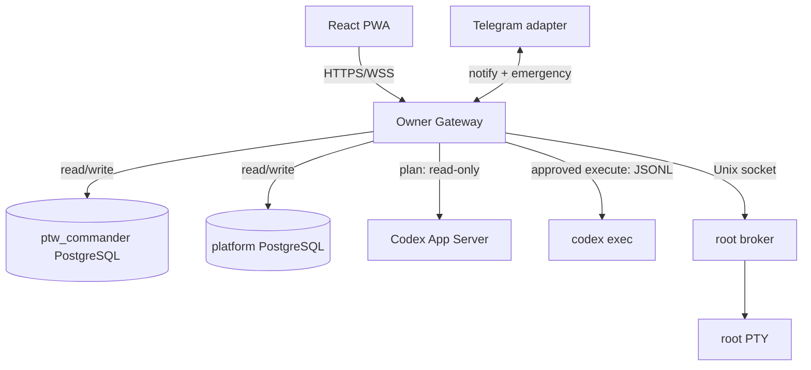

# PTW Commander architecture

Status: canonical
Updated: 2026-08-17

## Mission

Build a remotely operated company with a plausible path to a USD 20M sale or
valuation within 36 months from mission activation. Automation is bounded by
versioned policy; break-glass root access is explicitly outside that policy.

## System boundary

Firebase provides verified Google identity, blocking-function allowlisting, ID
tokens, and App Check. The gateway independently enforces provider, verified
email, pinned UID, ID-token audience/issuer, and App Check. Firebase is not a
domain store.

## Runtime authority

- PostgreSQL owns entities, typed projections, immutable revisions,
  relationships, jobs, feedback, and audit metadata.
- Git owns code, policy, migrations, prompts, and canonical Markdown.
- Generated files are immutable artifacts addressed by digest.
- The PWA caches only its static shell.

Permanent Commander IDs are UUIDv7. The independent engineering platform keeps
`TASK-<n>` and `ISSUE-<n>` references. Cross-system aliases are scoped and never
replace native IDs.

## Learning invariants

Research enters through `ResearchKnowledgeService`, so hypotheses retain
`derived_from` edges to permanent sources. Creative feedback is append-only:
`HumanFeedback` evaluates a Creative, annotation data references the Creative
UUID and Artifact digest, and each `WeightUpdate` adjusts reusable Components.
Corrections create revisions joined by `supersedes`; rows are not rewritten.

Instagram behavior is confined to an adapter. The core vocabulary—Hypothesis,
Creative, Artifact, HumanFeedback, WeightUpdate, Insight, Decision, and
KnowledgeAssertion—is channel-independent.

## Execution

Plan mode uses Codex App Server through an internal transport and a read-only
sandbox. Approval records a SHA-256 digest of the immutable plan. Execute mode
uses `codex exec --json`; JSONL events are streamed and persisted as bounded,
sanitized operational events. One approval starts at most one execution.

Validated non-destructive deployment may continue automatically. Destructive
work requires an exact preview and owner confirmation. Emergency
stop is checked before each external side effect.

## Root terminal

The broker listens on a root-only Unix socket. The authenticated gateway is the
only network bridge and exposes one WSS PTY session with 15-minute idle and
60-minute maximum duration. Only session metadata is stored, never terminal
transcript. The UI labels this path break-glass because commands bypass
Commander policy. SSH keys and passphrases never enter browser state or Git.

## Telegram

Telegram is a thin emergency adapter. Only `/help`, `/status`, and `/stop` are
operational commands; other input returns a deep link to the web console. The
established long poller and allowlists remain the single update consumer and
security boundary. Proactive outbound notifications are retired on the 1 GB
profile.

## Recovery

Gateway and root broker do not depend on production domain databases, allowing
them to remain reachable during a reset. Production reset is intentionally
backup-free by owner decision, requires the exact confirmation phrase, and is
irreversible. Roles, volumes, Git, SSH, Caddy, and credentials are never reset.
