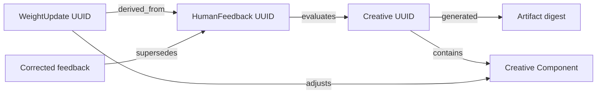

# Creative feedback learning

Status: web review contract
Updated: 2026-08-22

Human feedback is an append-only signal, not an overwrite of knowledge. The
owner selects a generated Creative in Commander Web and submits:

- rating 1–5 and an overall comment;
- optional predicted CTR for a ten-variant review;
- zero or more pin, rectangle, or freehand regions;
- a comment for each region.

All coordinates are normalized to `[0,1]`, so annotations remain aligned across
phone and desktop rendering. The request must include the selected Creative
UUID and its immutable Artifact SHA-256 digest; the gateway rejects mismatches.

Each accepted submission appends `HumanFeedback`, a normalized annotation
projection, one or more `WeightUpdate` entities, and graph edges in the same
transaction. Current component weight is a projection of immutable history.
Corrections append a new feedback revision; they never update the previous row.

For a ten-variant batch, feedback commits before the producing A01–A10 context
creates its conclusion. Only after that conclusion commits may the next image
enter review. A single post uses rating/comment without batch advancement.
Review history is bounded in the API but the PostgreSQL graph remains complete.

Branding is a text-only review specialization with two unambiguous outcomes.
A non-empty owner comment is a change request: rating and annotations are
omitted, the immutable Creative and Artifact are resolved server-side, and
append-only feedback plus zero-delta WeightUpdates retain lineage without
fabricating preference strength. The BrandRunner then creates a new immutable
Creative derived from that feedback and linked to the old Creative through
`supersedes`. An empty field is an explicit approval of the current Creative.
A change request never counts as approval and never advances to the next logo.

After a Brand Kit is approved, the same feedback contract powers a bounded
post-kit logo revision. Owner Gateway resolves the active kit's current
Creative and digest, appends feedback, and queues an immutable candidate. The
candidate Creative `supersedes` the approved Creative and is `derived_from` the
feedback, but does not become active merely because generation passed. Review
exposes immutable Before/After assets and compliance. Rejection leaves the kit
unchanged; explicit approval creates a new BrandKit that `supersedes` the old
kit and `contains` the candidate Creative. Earlier Creatives, Artifacts,
HumanFeedback, and WeightUpdates remain queryable.
